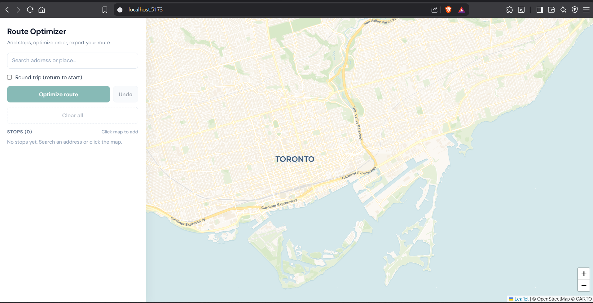
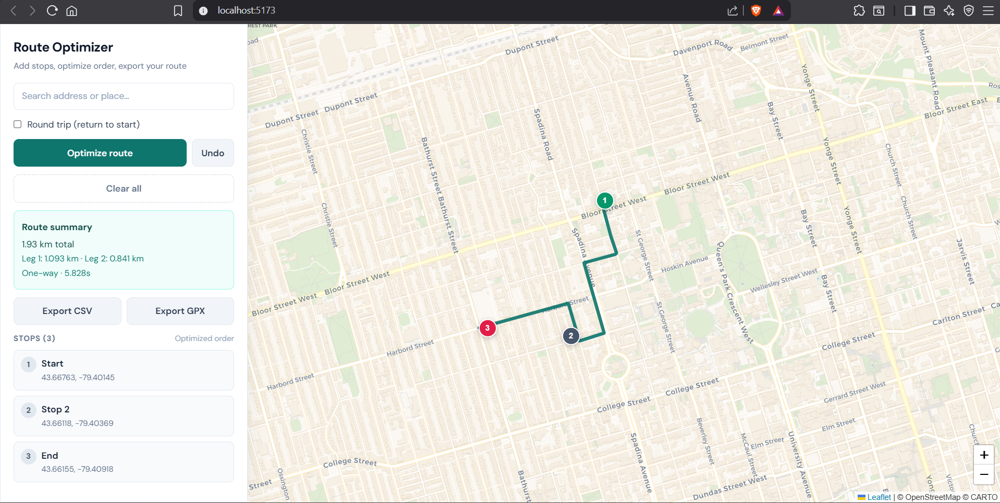

# Route Optimizer System

Route Optimizer is a full-stack mapping project that finds an efficient order for visiting multiple stops and renders a street-following route on an interactive map.

This project is built as an internship portfolio piece to demonstrate:
- graph-based optimization and algorithmic decision-making,
- backend API design with validation and error handling,
- frontend mapping UX with React + Leaflet,
- practical software engineering workflow (lint, tests, CI).

## Demo

- Live demo: _coming soon_
- Demo video/GIF: _coming soon_

## Screenshots


_Main map experience with optimized street route and sidebar controls._


_Ordered stops in the sidebar with rendered route on the map._

## Key Features

- Click-to-add stops that are reordered into an optimized visit sequence.
- Street-constrained route rendering built from OpenStreetMap road graph data.
- FastAPI backend with typed request validation and structured error responses.
- UI focused on operational clarity: itinerary ordering, state feedback, and map context.
- Basic engineering reliability through linting, tests, and CI automation.

## Tech Stack

- Frontend: React, Vite, Leaflet, Axios
- Backend: FastAPI, OSMnx, NetworkX, Shapely
- Tooling: ESLint, pytest, GitHub Actions

## Architecture

- `frontend`: user interactions, marker management, API call, route rendering.
- `backend`: input validation, road-graph loading/caching, route ordering, segment pathfinding.

Request flow:
1. User drops stops on map.
2. Frontend sends points to `POST /route`.
3. Backend validates and loads appropriate road graph area.
4. Backend computes optimized stop order and route segments.
5. Frontend renders optimized itinerary and polyline route.

## Setup (Local)

### 1) Backend

```bash
cd backend
python -m venv venv
venv\Scripts\activate
pip install -r requirements.txt
uvicorn main:app --reload --port 8000
```

### 2) Frontend

```bash
cd frontend
copy .env.example .env
npm install
npm run dev
```

Open the local frontend URL shown by Vite and click points on the map.

## Environment Configuration

- Frontend `.env`:
  - `VITE_API_BASE_URL=http://localhost:8000`
- Backend `.env`:
  - `CORS_ORIGINS=*` (tighten this for production)

## API

### `POST /route`

Request:

```json
{
  "points": [[43.6532, -79.3832], [43.66, -79.39], [43.64, -79.38]]
}
```

Response:

```json
{
  "status": "success",
  "optimized_stops": [[...], [...]],
  "full_path": [[...], [...]],
  "total_km": 4.82,
  "solve_time_seconds": 1.247,
  "leg_distances_km": [1.2, 1.8, 1.82]
}
```

## Engineering Quality

- Frontend linting via ESLint
- Backend tests via pytest + FastAPI TestClient
- CI workflow for lint/build/tests on push and pull request

Run checks locally:

```bash
cd frontend && npm run lint
cd backend && python -m pytest -q
```

## Known Limitations

- Road geometry quality varies by OpenStreetMap area completeness.
- Some edge-case routes may still require additional path-smoothing work.
- Advanced constraints (time windows, vehicle capacity, multi-vehicle routing) are not yet implemented.
- Distance metrics are currently experimental and should not be treated as logistics-grade billing values.

## Future Improvements

- Add address search (geocoding) and marker edit/delete/reorder controls.
- Add route export options (CSV/GPX) and shareable route links.
- Add strict road-mode validation for route connectors near clicked pins.
- Deploy frontend + backend publicly and add a hosted demo link.
- Add benchmark scenarios and performance profiling notes.

## Why This Project Matters

This project demonstrates end-to-end product engineering: turning route optimization logic into a usable map experience, validating API contracts, and iterating quickly from user feedback. It showcases the ability to ship across frontend, backend, and quality tooling in a way that aligns with production-level expectations.
